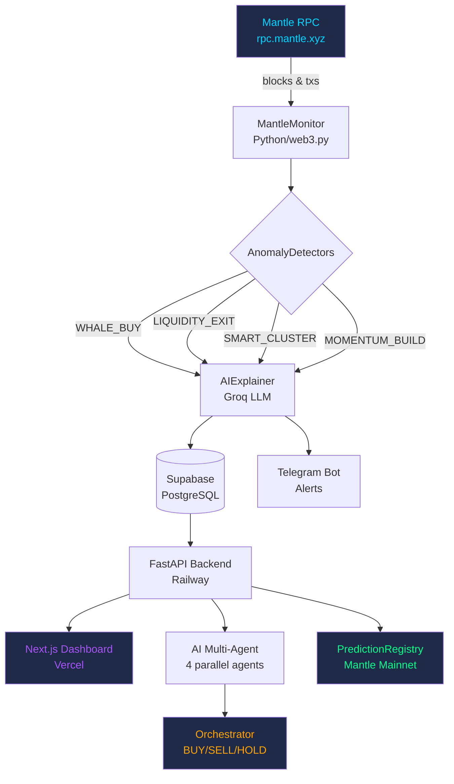

# AlphaPulse — AI Smart Money Intelligence on Mantle

> **"Whales don't sleep. Now you know what they're doing — before the market reacts."**

[](https://alpha-pulse-hackaton.vercel.app)
[](https://alpha-pulse-hackaton-production.up.railway.app)
[](https://mantlescan.xyz)
[](https://t.me/AlphaPulseBot)
[](https://mantlescan.xyz/address/0x4597f29db1FBFAbfCEdDb3E9dEF7cfD584dbA090#code)
[](https://alpha-pulse-hackaton-production.up.railway.app/)

---

## What is AlphaPulse?

AlphaPulse is a **real-time on-chain intelligence platform** for Mantle Network. It detects smart money movements, explains them with AI, and lets you copy the strategies of top-performing wallets — all verified on-chain.

**Not another dashboard. A trading edge.**

---

## 🔥 Killer Features

### 🤖 AI Multi-Agent System
Four specialized AI agents run in parallel, each analyzing a different dimension of the market:

| Agent | Analyzes | Output |
|---|---|---|
| 🐋 Whale Tracker | Large wallet movements | Accumulation / Distribution pattern |
| 📊 DEX Analyzer | Liquidity & volume | Health / Rug pull risk |
| 🛡 Risk Assessor | All anomaly signals | Risk level: LOW / MEDIUM / HIGH / CRITICAL |
| 🧠 Sentiment Analyzer | Bullish vs bearish signals | Market sentiment + outlook |

An **Orchestrator** synthesizes all four into a single signal: **BUY / SELL / HOLD / WAIT** with confidence score and reasoning.

### 💰 Copy Trading Leaderboard
Track the most profitable wallets on Mantle. See their strategy, win rate, and total profit. One-click copy (coming in v2).

### 📰 AI Daily Briefing
Every morning, AlphaPulse generates a Bloomberg-style market brief based on real on-chain data: whale activity, gas trends, liquidity changes, and today's outlook.

### 💬 AI Chat (Demo: 1 free question/day)
Ask anything about the Mantle market. The AI answers with real context — current anomalies, gas price, block data. Upgrade for unlimited access.

### 🔍 AI Wallet & Token Analyzer
Paste any address. AlphaPulse auto-detects:
- **Wallet** → trading strategy, risk profile, copy recommendation
- **Token** → safety score, honeypot detection, security verdict

### 📡 Live Smart Money Alerts
Real-time detection of 4 anomaly types on Mantle blockchain:

| Signal | Trigger | Priority |
|---|---|---|
| WHALE_BUY | Single wallet buys >$50K in <1h | CRITICAL |
| LIQUIDITY_EXIT | LP withdrawal >20% of pool | CRITICAL |
| SMART_CLUSTER | 5+ wallets buy same token in <10min | HIGH |
| MOMENTUM_BUILD | Volume >3σ above 7-day average | MEDIUM |

### 📊 DEX Analytics
Real-time data from FusionX V3 and Merchant Moe via official subgraphs. Volume, TVL, top pairs, large swaps.

### 🔬 Token Scanner
Scans new ERC20 deployments on Mantle. Safety score 0–100, honeypot detection, verification status.

### ⚡ On-Chain Pulse
Live network metrics: gas price heatmap (Etherscan-style), TPS, network congestion, bridge activity, active addresses.

### 📈 AI Market Predictions
Multi-timeframe predictions (1H / 6H / 24H) with confidence scores, key factors, and historical accuracy tracking.

---

## ✅ Smart Contracts — Verified on Mantle Mainnet

Both contracts are **verified and live on Mantle Mainnet (Chain ID: 5000)**.

### PredictionRegistry
**`0x4597f29db1FBFAbfCEdDb3E9dEF7cfD584dbA090`**
[View on Mantlescan →](https://mantlescan.xyz/address/0x4597f29db1FBFAbfCEdDb3E9dEF7cfD584dbA090#code)

Every prediction AlphaPulse makes is **timestamped and hashed on-chain**. This means:
- Predictions cannot be backdated or faked
- Anyone can verify accuracy on Mantlescan
- Full transparency — no black box

Functions:
- `registerPrediction(bytes32 hash, string calldata predictionType)` — records a new prediction
- `verifyPrediction(uint256 id, bool correct)` — marks prediction as correct/incorrect after 24h
- `getPrediction(uint256 id)` — returns prediction data, timestamp, and result

### AnomalyRewards
**`0xCD71e0A3dB3d31e81c1f0961e6B8E58e863A6119`**
[View on Mantlescan →](https://mantlescan.xyz/address/0xCD71e0A3dB3d31e81c1f0961e6B8E58e863A6119#code)

The rewards contract for the future staking system:
- Users stake MNT on signals they believe in
- Correct predictions share the reward pool
- Incorrect predictions lose their stake
- 10% platform fee sustains the protocol

Functions:
- `stakeOnSignal(uint256 signalId)` — stake MNT on a prediction
- `claimReward(uint256 signalId)` — claim reward after verification
- `getSignalPool(uint256 signalId)` — view total staked amount

---

## 🏗️ Architecture



**Stack:**
- Backend: Python 3.11, FastAPI, web3.py, Groq LLM (`llama-3.3-70b-versatile`)
- Frontend: Next.js 16, TypeScript, Tailwind CSS v4, Framer Motion
- Database: Supabase (PostgreSQL + Realtime)
- Contracts: Solidity 0.8.25, Hardhat, OpenZeppelin
- Deploy: Railway + Vercel

---

## 💼 Business Model

| Tier | Price | Features |
|---|---|---|
| Free | $0 | 1 AI chat/day, basic alerts |
| Premium | $29/mo | Unlimited AI, priority alerts, copy trading |
| API | $99/mo | Full API access, webhooks |
| Enterprise | $499/mo | Custom integrations, dedicated support |

**Copy Trading fee:** 10% of profits (only when you win)

Zero backend costs for free users. All compute costs scale with revenue.

---

## 🚀 If AlphaPulse Goes to Production

### Phase 1 — Foundation (Month 1–2)
- [ ] **Real Copy Trading** — auto-execute trades via wallet connect (WalletConnect v2)
- [ ] **Telegram Premium** — gated alerts, priority signals, AI chat unlimited
- [ ] **Mobile App** — React Native, push notifications
- [ ] **More chains** — Base, Arbitrum, Optimism alongside Mantle

### Phase 2 — Intelligence (Month 3–4)
- [ ] **Social Signals** — Twitter/X mentions, GitHub commits, Discord activity
- [ ] **Token Launchpad Monitor** — detect new listings before they pump
- [ ] **Wallet Clustering** — identify coordinated wallets (bots, funds, insiders)
- [ ] **Custom Alerts** — user-defined thresholds and conditions

### Phase 3 — Ecosystem (Month 5–6)
- [ ] **AnomalyRewards staking** — activate the on-chain rewards contract
- [ ] **DAO governance** — community votes on signal thresholds
- [ ] **API marketplace** — sell signal feeds to other protocols
- [ ] **White-label** — sell AlphaPulse as infrastructure to other DEXes

### 🦅 RealClaw Integration
RealClaw's wallet intelligence layer would supercharge AlphaPulse:
- **Wallet reputation scores** — cross-chain history, not just Mantle
- **Entity identification** — link anonymous wallets to known funds/whales
- **Cluster detection** — identify coordinated multi-wallet strategies
- **Risk scoring** — flag wallets associated with exploits or rug pulls

Combined with AlphaPulse's real-time detection, this creates the most comprehensive smart money intelligence platform in DeFi.

### What Would Make AlphaPulse a Rocket 🚀

1. **Real P&L tracking** — connect wallet, see actual returns from following signals
2. **Backtesting engine** — test any strategy against 6 months of Mantle history
3. **Signal marketplace** — top traders sell their strategies, AlphaPulse takes 5%
4. **Institutional API** — hedge funds pay $5K+/mo for raw signal feeds
5. **Cross-chain expansion** — same engine on 10 chains = 10x addressable market
6. **AI model fine-tuning** — train on Mantle-specific patterns for higher accuracy
7. **Prediction NFTs** — mint verified predictions as NFTs, trade accuracy records

---

## 📊 Market Opportunity

| Market | Size |
|---|---|
| TAM — Crypto trading tools | $8.5B |
| SAM — AI-powered signals | $1.2B |
| SOM — Year 3 target | $120M |

Comparable: Nansen ($150M valuation), Dune Analytics ($1B), Chainalysis ($8.6B)

**AlphaPulse differentiator:** The only platform combining real-time detection + AI explanation + on-chain verification + copy trading in one product.

---

## 🏆 Turing Test Hackathon 2026

**Built for:** Turing Test Hackathon 2026 by Mantle Network
**Prize Pool:** $100,000
**Deadline:** June 15, 2026
**Network:** Mantle Mainnet (Chain ID: 5000)

### Requirements Met
- ✅ Deployed on Mantle Mainnet — contracts live and verified
- ✅ Real-time Mantle RPC monitoring
- ✅ AI-powered insights (Groq LLM, multi-agent architecture)
- ✅ On-chain verifiable predictions (PredictionRegistry)
- ✅ Measurable accuracy metrics tracked on-chain
- ✅ Production Telegram bot with subscribers
- ✅ User rewards system (AnomalyRewards contract)
- ✅ Professional Bloomberg Terminal UI
- ✅ Copy trading leaderboard
- ✅ DEX analytics from official subgraphs
- ✅ AI Daily Briefing
- ✅ AI Chat with market context

---

## ⚡ Quick Start

```bash
# Backend
cd backend
pip install -r requirements.txt
python main.py

# Frontend
cd frontend
npm install
npm run dev
```

**Environment variables:**
```env
# backend/.env
MANTLE_RPC_URL=https://rpc.mantle.xyz
GROQ_API_KEY=your_key
TELEGRAM_BOT_TOKEN=your_token
SUPABASE_URL=your_url
SUPABASE_KEY=your_key

# frontend/.env.local
NEXT_PUBLIC_API_URL=http://localhost:8000
```

---

## 📁 Project Structure

```
AlphaPulse/
├── backend/
│   ├── main.py           # FastAPI + all endpoints
│   ├── ai_agents.py      # Multi-agent AI system
│   ├── copy_trading.py   # Copy trading logic
│   ├── dex_analytics.py  # FusionX/Merchant Moe subgraphs
│   ├── token_scanner.py  # New token detection
│   ├── onchain_pulse.py  # Gas, TPS, bridge metrics
│   ├── monitor.py        # Mantle blockchain monitor
│   ├── detectors.py      # Anomaly detection engine
│   └── ai_explainer.py   # Groq LLM integration
├── frontend/
│   └── components/
│       ├── AIAgentDashboard.tsx   # Multi-agent WOW block
│       ├── AIDailyBriefing.tsx    # Daily market brief
│       ├── AIChat.tsx             # AI chat + analyzer
│       ├── CopyTradingDashboard.tsx
│       ├── DEXAnalytics.tsx
│       ├── TokenScanner.tsx
│       ├── OnChainPulse.tsx       # Gas heatmap
│       ├── AIPredictionsPro.tsx
│       └── AlertFeedCompact.tsx
└── contracts/
    ├── PredictionRegistry.sol     # On-chain prediction proofs
    └── AnomalyRewards.sol         # Staking & rewards
```

---

*AlphaPulse — because the next 10x move is already on-chain. You just need to know where to look.*
